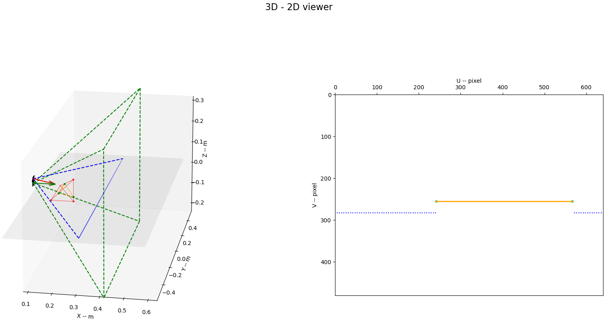

# slsim

> structured light simulation 

*only for theoretical analysis, simulation or design*

## usage

编辑 config.yaml，内容包括线激光位置、张角和相机位置、FOV、内参

编辑 obstacle.txt，内容包括障碍物各顶点在 world frame 下的坐标

`./bin/data_gen -f` 使用 config.yaml 中的参数进行可视化

`./bin/data_gen -xx xx` 修改特定参数

生成文件位于 data/gend/

python drawer.py 进行可视化

- left
  - 绿色，虚线相机 FOV
  - 蓝色，激光光平面（地面）
  - 红色，3D 凸包
  - 橙色，光平面和凸包交线
- right
  - 蓝色，地面基准点
  - 橙色，障碍物交线投影到障碍物

with many ugly temp codes and known issues !!! :)